# glboost-test
Test of GLBoost

## GLBoost サンプル

### LiquidFun

### Geometry

### Particle

[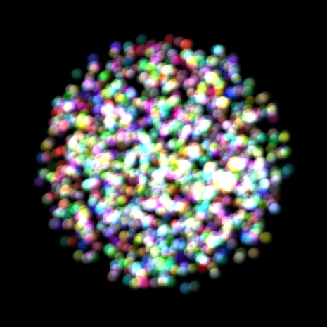](https://cx20.github.io/glboost-test/jsdo.it/cx20/gj2y/)

### 惑星

[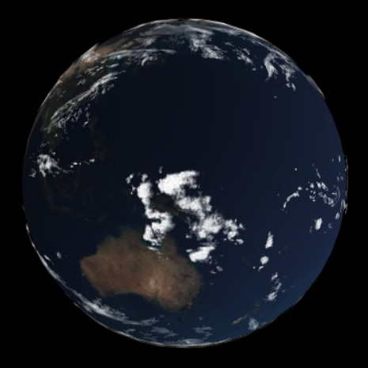](https://cx20.github.io/glboost-test/jsdo.it/cx20/K3ez/)

[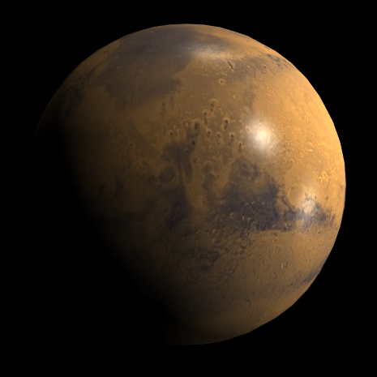](https://cx20.github.io/glboost-test/jsdo.it/cx20/a3pkc/)

<!--
[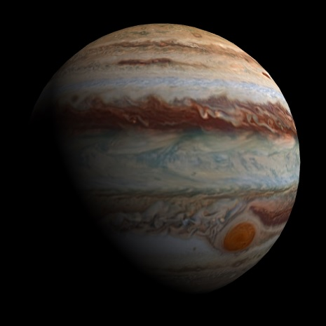](https://cx20.github.io/glboost-test/jsdo.it/cx20/6wiY/)
-->

### 物理演算

[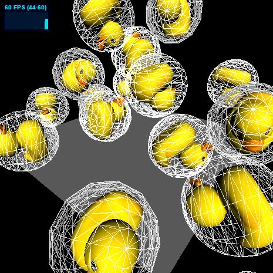](https://cx20.github.io/glboost-test/jsdo.it/cx20/Kx37/)

[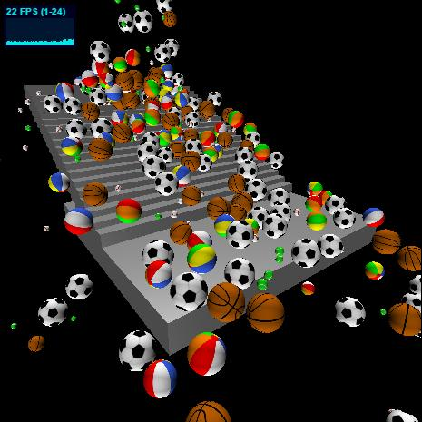](https://cx20.github.io/glboost-test/jsdo.it/cx20/45Wj/)

[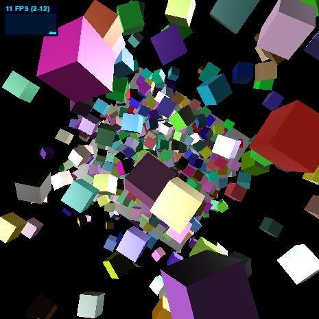](https://cx20.github.io/glboost-test/jsdo.it/cx20/Ili6/)

### PBR

[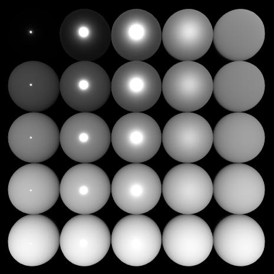](https://cx20.github.io/glboost-test/jsdo.it/cx20/YYjT/)

[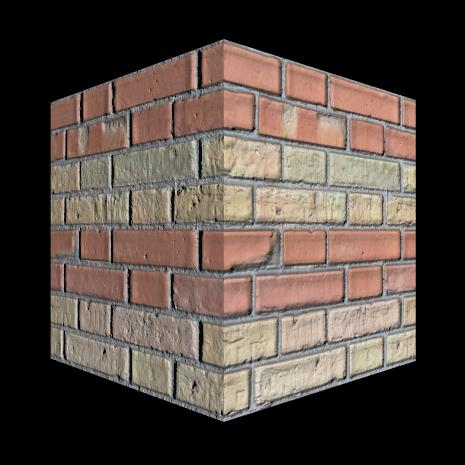](https://cx20.github.io/glboost-test/jsdo.it/cx20/yMD9/)

[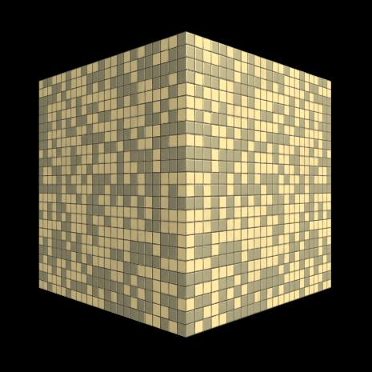](https://cx20.github.io/glboost-test/jsdo.it/cx20/Ml8A/)

### glTF

[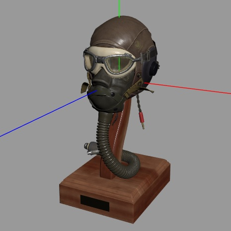](https://cx20.github.io/glboost-test/jsdo.it/cx20/Q4Pa/)

[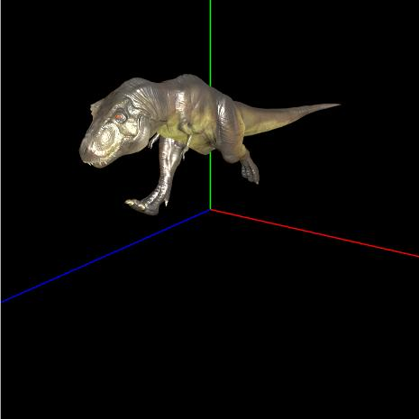](https://cx20.github.io/glboost-test/jsdo.it/cx20/QzHY/)

### ３次元曲線

[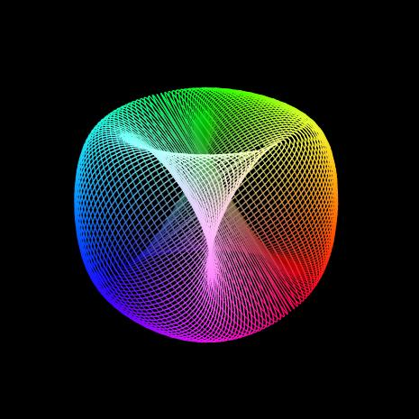](https://cx20.github.io/glboost-test/jsdo.it/cx20/WO1O/)

[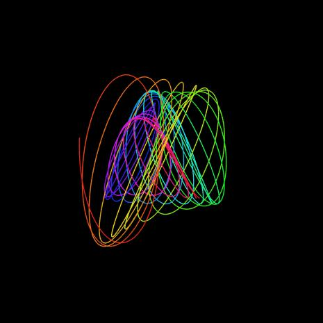](https://cx20.github.io/glboost-test/jsdo.it/cx20/Ugq6/)

### プリミティブ型

[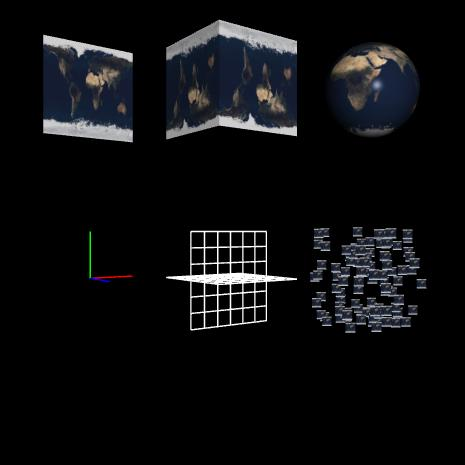](https://cx20.github.io/glboost-test/jsdo.it/cx20/MaoR/)

